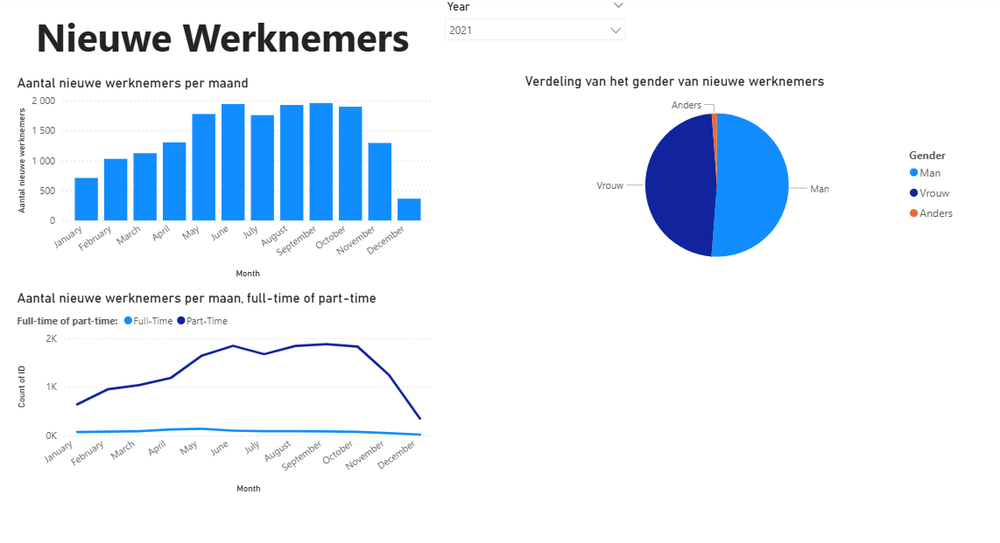
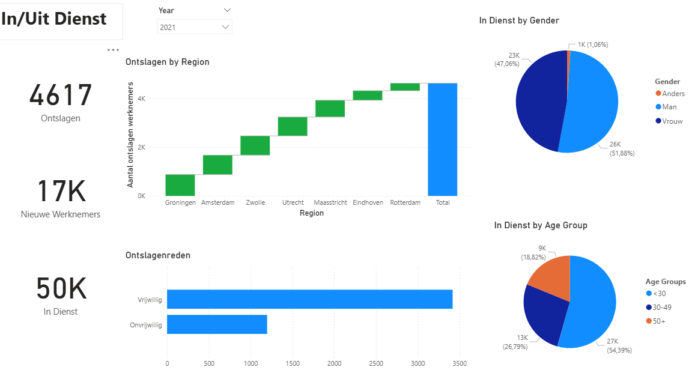
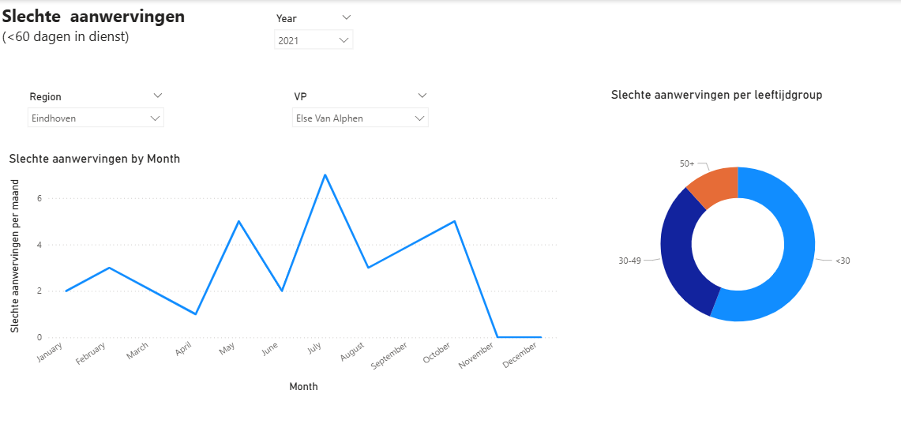
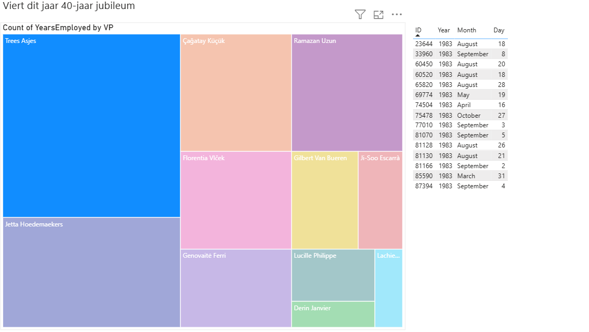
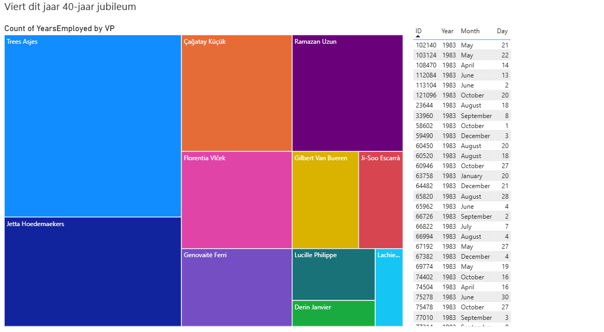

# HR Dashboard

This Power BI dashboard is designed to support the Human Resources department by analyzing employee data such as hiring trends, attrition rates, and work anniversaries. It provides valuable insights for HR decision-making, including filtering options for regions, years, and leadership roles.

## Features
- **New Employees Overview**: Monitors:
  - Monthly new hires
  - Gender breakdown
  - Full-time vs part-time status
- **In/Uit Dienst** (Hired/Fired): Shows:
  - Number of employees hired, fired (voluntarily or involuntarily), and currently employed
  - Gender and age group distribution (pie charts)
  - Firing trends by region and year
- **Bad Hires Analysis**: Tracks hires that left the company in under 60 days, broken down by age group, VP, region, and month.
- **40-Year Anniversary Visualization**: Highlights employees celebrating their 40-year work anniversary, using treemaps and tables.

## Dataset

The dashboard is based on anonymized employee data, structured in multiple tables, and imported using Power BI's data model tools.

[date.csv](https://prod-jarvis-public.s3.eu-west-1.amazonaws.com/38fe7a67-e318-4ff1-bbf5-f42e2cc7a44c/nl/1/date.csv)

[employee.csv](https://prod-jarvis-public.s3.eu-west-1.amazonaws.com/38fe7a67-e318-4ff1-bbf5-f42e2cc7a44c/nl/1/employee.csv)

[manager.csv](https://prod-jarvis-public.s3.eu-west-1.amazonaws.com/38fe7a67-e318-4ff1-bbf5-f42e2cc7a44c/nl/1/manager.csv)

## Visuals

Includes pages:
- **New Employees**
- **In/Uit Dienst**
- **Slechte Aanwervingen**
- **40-Year Work Anniversaries**

## Screenshots

