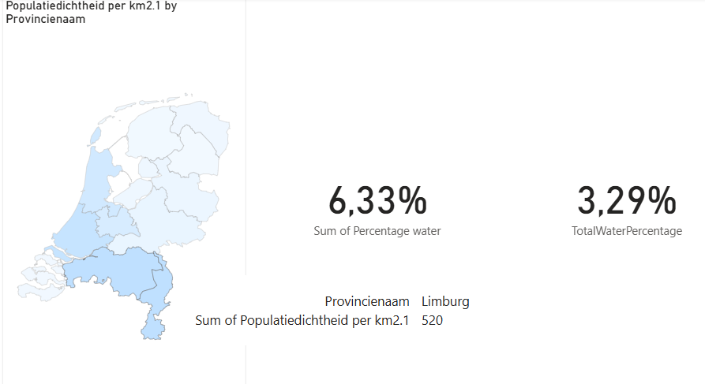

# Interactive Map: Water and Population Density in the Netherlands

This Power BI dashboard visualizes geographic data across Dutch provinces, focusing on population density and water coverage.

## Key Features

- Choropleth map of the Netherlands showing population density by province (darker = denser)
- Province selector to filter data dynamically
- Calculated KPIs:
  - Total water surface (%) in the selected province
  - Percentage of land covered by water in the selected province

## Skills Demonstrated

- Geographic mapping in Power BI
- Dynamic filtering and interaction
- Measure calculations using DAX
- Interactive KPI tiles

## Example Use Case

A basic tool for comparing land and water distribution across the Netherlands and identifying densely populated regions.

## Dataset:** The dataset was sourced from a public CSV file:  
[nederland.csv](https://prod-jarvis-public.s3.eu-west-1.amazonaws.com/ec8a5143-e58d-43db-9ea4-2e6f50fe406c/nl/1/nederland.csv)

## Screenshots

  
*Population density map of the Netherlands*

  
*Province selected and KPIs updated accordingly*
