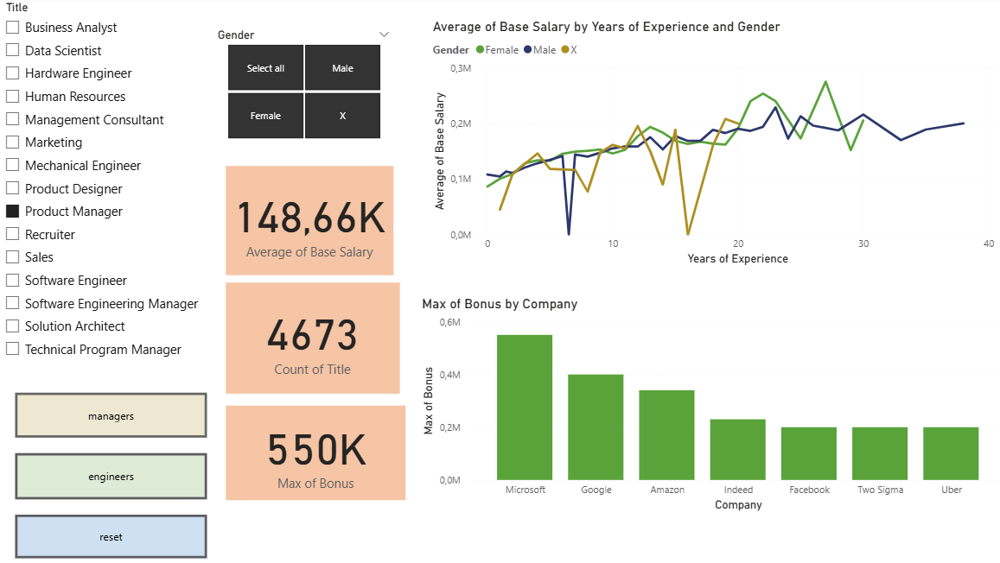
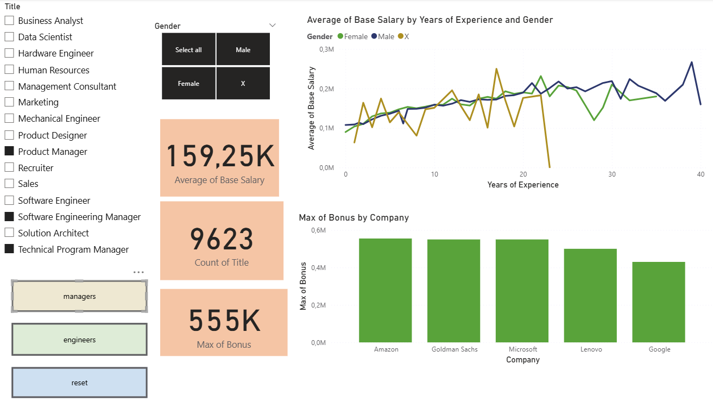
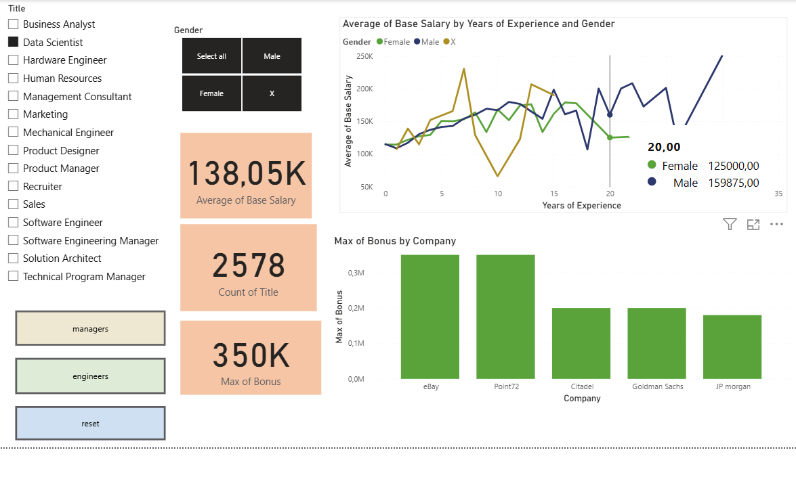
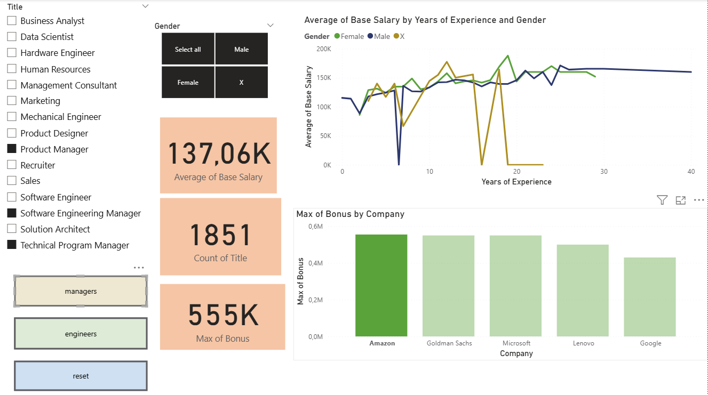

# Salary Analysis Dashboard (Power BI)

## Overview

This Power BI dashboard explores salary data from individuals working in the IT sector. It provides interactive visuals and insights based on factors such as gender, company, years of experience, and job role.

## Features

- Filter buttons to quickly select groups such as "All Managers" or "All Engineers"
- Dynamic metrics showing:
  - Total number of people selected
  - Maximum salary in the selection
  - Maximum bonus in the selection
- Comparisons by:
  - Gender
  - Company
  - Job title
  - Years of experience

## Dataset

The dataset was sourced from a public CSV file:  
[salaries_powerbi.csv](https://prod-jarvis-public.s3.eu-west-1.amazonaws.com/8fd0ba12-2e1a-446f-9a73-4f3ee7a97081/nl/1/salaries_powerbi.csv)

## Screenshots

